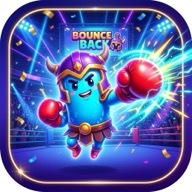
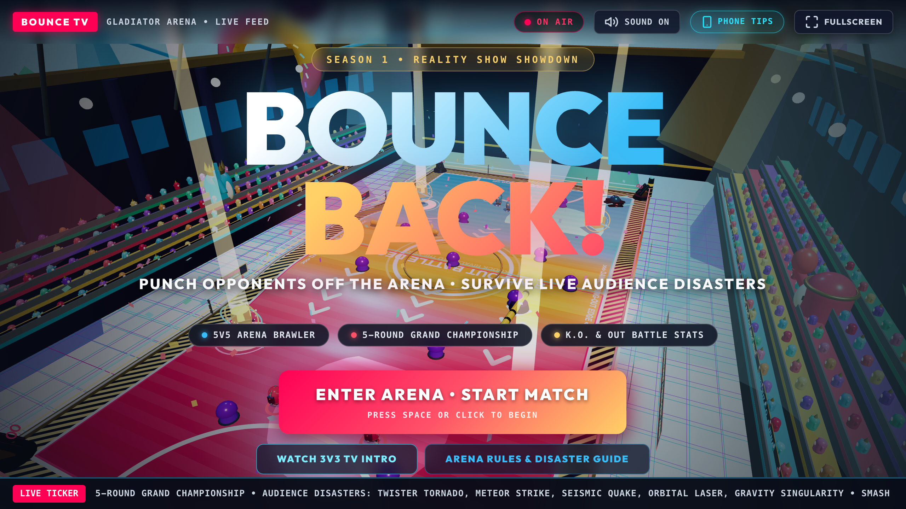
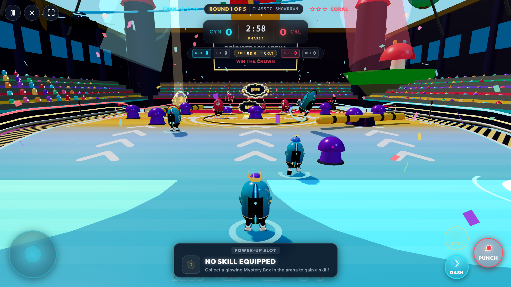
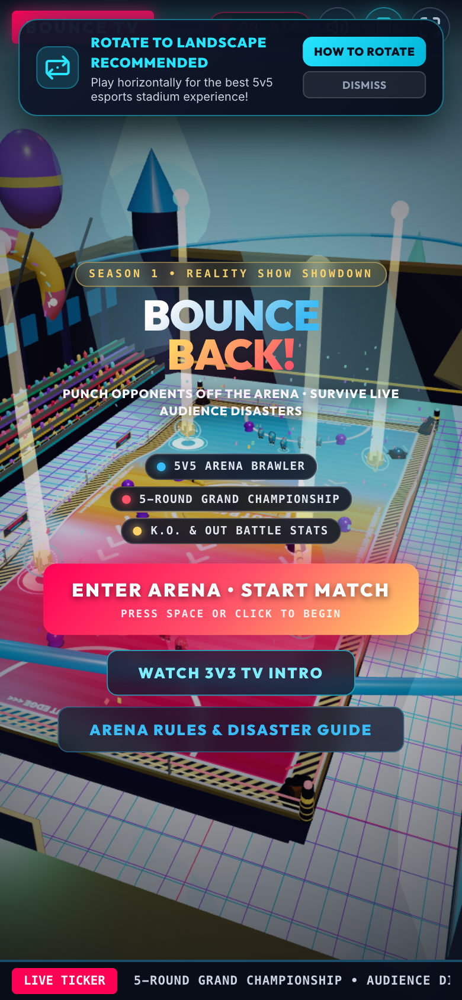
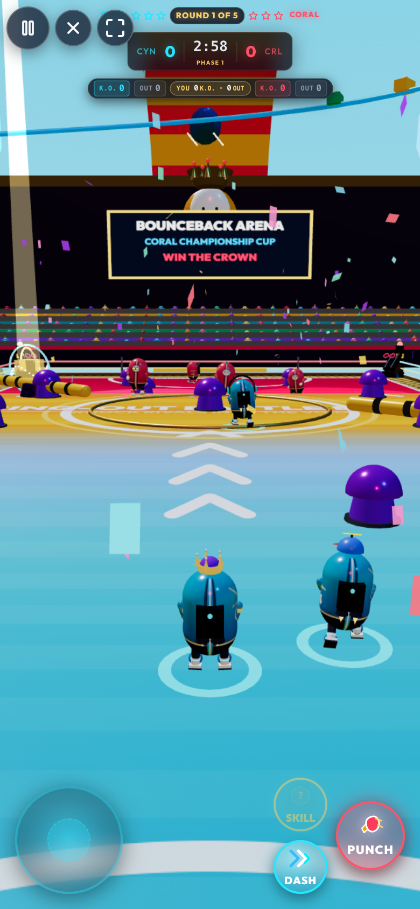

# 🥊 BOUNCEBACK!

<div align="center">



**High-Octane 5v5 Reality TV Pinball Ring-Out Brawler**  
*Built with Three.js, React 19, and Vite for 404 Game Jam 001*

[](https://github.com/404-Repo/404-game-jam/pull/23)
[](https://bounceback-beta.vercel.app)
[](https://threejs.org/)
[](https://react.dev/)
[](https://www.typescriptlang.org/)

[🎮 **PLAY BOUNCEBACK LIVE**](https://bounceback-beta.vercel.app) • [🏆 **VIEW 404 JAM SUBMISSION PR**](https://github.com/404-Repo/404-game-jam/pull/23)

</div>

---

## 📸 Game Showcase

<div align="center">

### 📺 Broadcast Title Screen & Live 3D Stadium


### 💥 5v5 Pinball Coliseum Action & Ring-Out Battle


### 📱 Responsive Dual-Touch Mobile Experience
<p align="center">
  
  &nbsp;&nbsp;
  
</p>

</div>

---

## ⚡ Overview

**BounceBack** is a high-octane 5v5 team arena combat game fusing **brawler action** with **kinetic pinball physics** inside a televised gladiator coliseum.

Two full squads (**Team Cyan** vs **Team Coral**) clash on an elevated platform suspended high above a cosmic void. Punch, charge strike, and dash opponents over the perimeter ropes into the abyss to score **Ring-Out K.O.s**. Ricochet rivals off reactive neon pinball bumpers to build massive combo multipliers, trigger game-altering mystery power-ups, and survive cataclysmic disasters voted live by the broadcast audience!

---

## ✨ Key Features

### 1. 🤼 5v5 Simultaneous Physics Battle (10 Real-Time Entities)
- Unlike typical solo runner or vehicle jam entries, **BounceBack runs 10 active 3D fighters on the arena floor at the same time** (1 player + 9 autonomous AI combatants).
- AI fighters execute authentic squad dynamics: aggressive pursuers, defensive backstops, flankers, and power-up contenders.

### 2. 🪩 Kinetic Pinball Bumpers & Multiplier Combos
- Electric pinball bumper pads placed around the arena floor launch colliding fighters at **1.5× impulse**.
- Chaining multiple bumper rebounds before a ring-out exponentially multiplies the scored points:
  $$\text{Points} = \text{Gate Multiplier} \times (1 + \text{Bounces} \times 0.5) \times \text{Combo Multiplier}$$

### 3. 🚨 Reality TV Live Audience Disaster Mayhem
Throughout each round, simulated broadcast viewers trigger live emergency disaster votes:
- 🌪️ **Twister Tornado (Category 5):** Roaring 3D vortex sucking all fighters skyward.
- ☄️ **Meteor Strike:** Cataclysmic bombardment scorching the arena floor.
- 🌋 **Seismic Quake (Magnitude 9.0):** Tectonic ground faultlines thrusting fighters upward.
- 🛰️ **Orbital Laser:** Plasma satellite death-ray sweeping across the turf.
- 🌌 **Gravity Singularity:** Black hole pulling all combatants inward before a concussive shockwave detonation.

### 4. 🎁 Holographic Mystery Power-Up Cubes
Smash rotating holographic cubes across the coliseum floor to unleash 3D cartoon party skills:
- 🥊 **Giga Fist:** Spring-loaded giant boxing glove punching outward with 3× range and shockwave impulse.
- 🍌 **Banana Peel:** Tactical trap that sends stepping victims into a 720° spin with cartoon halo stars.
- 🚀 **Rocket Boost:** Chrome twin thrusters with billowing flames, granting unstoppable bulldozer momentum.
- 🧲 **Giga Magnet:** Holographic horseshoe magnet with lightning tethers pulling the 3 nearest rivals.
- 💣 **Bounce Bomb:** Rolling explosive pinball bomb detonating into a gigantic fireball dome.
- ⚡ **Shrink Zap:** Quantum energy beam that shrinks enemies into tiny helpless beans.
- 💥 **One Punch Man:** Serious punch launching victims straight into the stratosphere!

### 5. 🏆 5-Round Grand Championship Tournament
- Best-of-5 tournament series across 5 distinct stadiums:
  - **Round 1:** Neon Speedway
  - **Round 2:** Stormland Colosseum
  - **Round 3:** Pinball Mania
  - **Round 4:** Cosmic Singularity
  - **Round 5:** Grand Championship Finale
- Each match features a 3-phase match structure leading to **Phase 3 OVERDRIVE (Triple K.O. Points!)**.
- First team to clinch 3 victories lifts the 3D Grand Golden Trophy!

---

## 🎮 Controls

### Desktop (Keyboard & Mouse)
| Action | Key / Input |
|---|---|
| **Move Fighter** | `W` `A` `S` `D` or `Arrow Keys` |
| **Punch / Strike** | `Space` or `Left-Click` (Magnetic Auto-Aim) |
| **Speed Dash** | `Shift` (Evade / Chase) |
| **Activate Mystery Skill** | `E` or `Q` or `Right-Click` |
| **Audience Poll Voting** | `1`, `2`, `3` |
| **Camera View Toggle** | `3RD CAM` Button (Close Action View) |
| **Audio Toggle** | `M` or Sound Button |

### Mobile & Touch Devices
- **Analog Joystick (`#stick`):** Responsive touch-drag joystick for full 360° locomotion.
- **Punch Button (`#punch`):** Big thumb-friendly button for rapid strikes and charged punches.
- **Dash Button (`#dash`):** Directional dash bursts with haptic vibration feedback.
- **Skill Button (`#skill`):** Instant power-up deployment.
- **Orientation Guide:** Built-in phone tips modal with full screen toggle and landscape guide.

---

## 🏅 Official 404 Game Jam Verdict

BounceBack officially passed the **404 Game Jam 001** phone evaluation gate executed via `harness/jam.mjs` (Emulating Android Chrome on Phone 390×844 @3x, 4G network throttling, CPU 2× slower):

```text
=== 404 JAM VERDICT ===
url             https://bounceback-beta.vercel.app
utc             2026-09-25T22:18:06.535Z
commit          72442e95451cc6820fbf999796968bcb89b75198
viewport        390x844 @3x phone, real touch, Android Chrome UA
network         4G: 4 Mbps down, 1 Mbps up, 60 ms latency, CPU 2x slower
ready           2.4 s   budget 20 s   PASS
weight          3.3 MB   budget 10 MB   PASS
started         yes (tap on #startb)
moved           16.7 m   needs 1 m   PASS
peak draws      688   budget 900   PASS
peak tris       615,320   budget 1,500,000   PASS
median fps      60 (ANGLE (Apple, ANGLE Metal Renderer: Apple M4, Unspecified Version))
errors          0   PASS
404s            0   PASS
external deps   none   cdn: fonts.googleapis.com, fonts.gstatic.com
outside folder  none, every file came from the game folder
RESULT: PASS
=== END ===
```

---

## 🛠️ Tech Stack & Architecture

- **Rendering Engine:** [Three.js r174](https://threejs.org/) (Pure procedural 3D code & lightweight geometry buffers)
- **UI Framework:** [React 19](https://react.dev/) + [TypeScript 5.7](https://www.typescriptlang.org/)
- **Bundler:** [Vite 8](https://vite.dev/)
- **Styling:** [Tailwind CSS v4](https://tailwindcss.com/)
- **Audio:** Web Audio API procedural synthesis + original soundtrack (`Yellow_Shell_Hustle.mp3`)
- **Hosting:** [Vercel](https://vercel.com/) Edge Network

---

## 🚀 Local Development

### Prerequisites
- Node.js 18+
- pnpm or npm

### Installation
```bash
# Clone the repository
git clone https://github.com/IrrhammCode/bounceback.git
cd bounceback

# Install dependencies
npm install

# Start Vite development server
npm run dev
```

### Production Build & Preview
```bash
# Compile optimized bundle
npm run build

# Preview production build locally
npm run preview
```

### Run Official 404 Jam Gate Test
```bash
node 404-game-recipe/harness/jam.mjs http://localhost:4173 --start="#startb" --hold="#stick"
```

---

## 👥 Credits

- **Team & Development:** [@IrrhammCode](https://github.com/IrrhammCode)
- **AI Coding Assistant:** Antigravity IDE (Gemini 3.8 Flash & Claude Opus 4.6)
- **Audio & Assets:** Original background score generated via Gemini; procedural Three.js assets and custom stadium textures.
- **Created for:** [404 Game Jam 001](https://github.com/404-Repo/404-game-jam)

---

<div align="center">
  <b>Step into the Coliseum. Dodge the Disasters. Ring-Out the Competition.</b><br>
  <sub>© 2026 BounceBack Team. Built with passion for 404 Game Jam.</sub>
</div>
